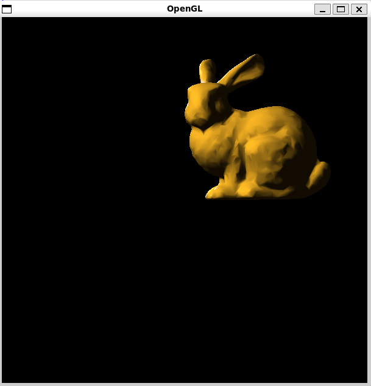
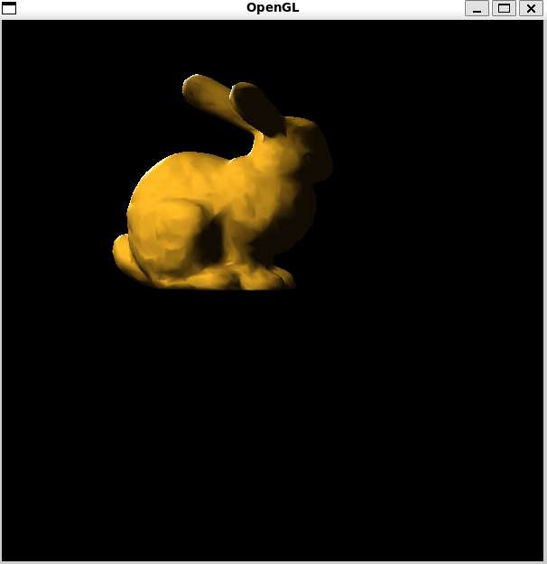
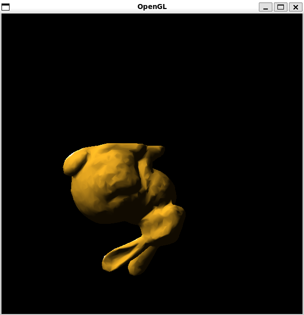
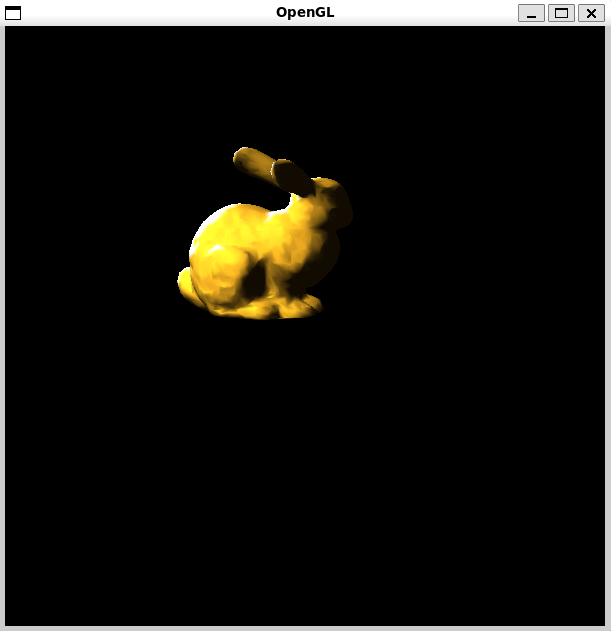
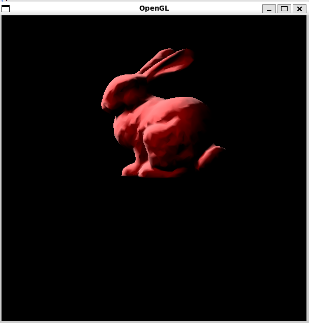
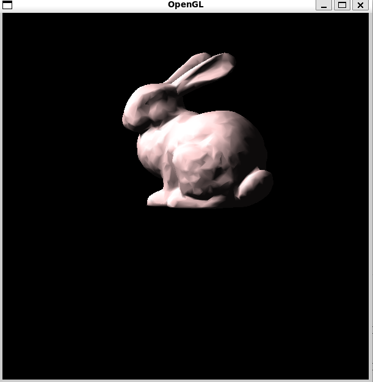
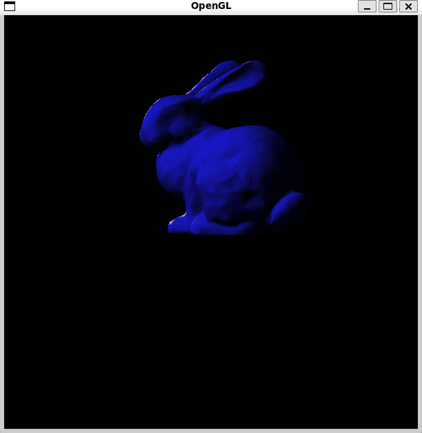
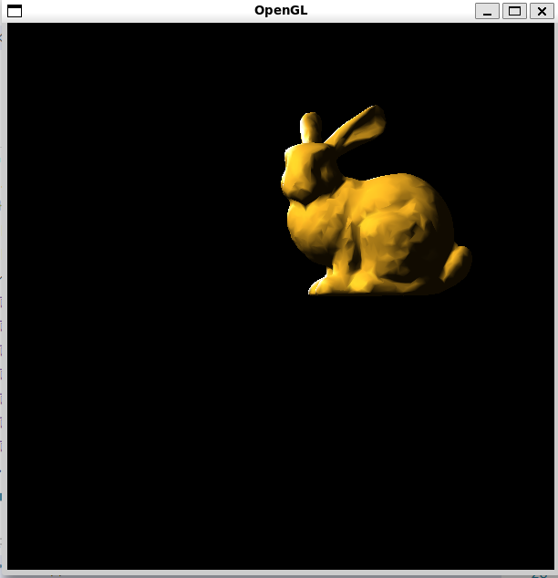

- [使用OpenGL显示三维模型](#使用opengl显示三维模型)
  - [功能](#功能)
  - [使用方法](#使用方法)
  - [代码结构](#代码结构)
  - [OBJ文件结构介绍](#obj文件结构介绍)
  - [Loadfile导入obj文件的实现](#loadfile导入obj文件的实现)
  - [顶点法线的计算](#顶点法线的计算)
  - [最终效果](#最终效果)
    - [模型内定义的法向量绘制结果：](#模型内定义的法向量绘制结果)
    - [自定义计算得到法向量绘制结果：](#自定义计算得到法向量绘制结果)

# 使用OpenGL显示三维模型
这是一个使用OpenGL库在3D空间中加载和渲染一个模型的项目。

## 功能

- 加载.obj文件中的模型数据
- 使用OpenGL函数进行模型渲染
- 支持模型的旋转和缩放
- 支持键盘操作来改变渲染材质

## 使用方法

    1. 编译并运行项目。

    2. 使用键盘上的'w'、's'和'a'键来改变渲染材质。
        - 分别对应黄铜、白玉、红色塑料和蓝色宝石材质，按下按键后立即显示。

    3.使用键盘上的方向键来控制旋转角度，鼠标的左右键来进行缩放控制，注意到长 按会一直进行缩放。

## 代码结构
主体部分：
- `main`: 包含主函数和OpenGL的渲染代码。

图形绘制部分：
- `loadFile()`:这个函数是model类的成员函数，主要是用于导入这个obj文件中的顶点(v)、法向量(vn)和面(f)， 
保存在model中的vertex,normals和faces。（注意只能处理这种类型的obj文件）
- `GLCube()`: 这个函数用于绘制模型，设置三角形的三个顶点和顶点的法向量，即可绘制出立体效果的obj模型
- `InitScene()`:这个函数主要是进行场景的初始化，主要是导入模型，开启光照，并允许深度测试。
- `DrawScene()`:这个函数是绘制图形主体部分，主要是对光源位置、强度进行设置，以及对渲染材质的设置，同时设置摄像机位置和模型旋转，最后调用glCube()进行渲染，glutSwapBuffers()交换前后缓冲区进行显示。
- `Normalize()`:OPENGL中对所有顶点的绘制最终都会转换到一个NDC设备坐标中，NDC是一个左手坐标系，其中x、y和z的值都在[-1, 1]的范围内，所以需要对model进行一个归一化处理。我选择方法是找出坐标中最大的X、Y和Z，最后进行归一化。也可以简单地旋转同时除以一个较大的整数例如（1000）
- `CalNormals()`:这个函数是自己定义的计算法向量的函数，思路也很简单，遍历每个面，计算面的法线，然后将这个法线加到面的每个顶点的法线上，然后对每个算出来的法线进行归一化处理。

控制部分：
- `keyboard()`: 这个函数用于处理键盘输入，主要对应设置材质的按键。
- `SpecialKeys()`:这个函数也是用于处理键盘输入，但是针对的是非ASCII码，例如方向键，利用它来进行旋转控制。
- `timer()`:这是一个定时器函数，和mouseclick函数配合使用，即可实现按下鼠标按键的时候连续地进行缩放控制。
- `MouseClick`:仅仅是用来记录鼠标状态，方便timer()的调用。

## OBJ文件结构介绍

- 顶点数据(Vertex data)： **v 几何体顶点(Geometric vertices)** vt 贴图坐标点(Texture vertices) **vn 顶点法线(Vertex normals)** vp 参数空格顶点 (Parameter space vertices)

- 自由形态曲线(Free-form curve)/表面属性(surface attributes): deg 度(Degree) bmat 基础矩阵(Basis matrix) step 步尺寸(Step size) cstype 曲线或表面类型 (Curve or surface type)

- 元素(Elements): p 点(Point) l 线(Line) **f 面(Face)** curv 曲线(Curve) curv2 2D曲线(2D curve) surf 表面(Surface)
## Loadfile导入obj文件的实现
这部分实现主要是充分利用了C++的特性，
```
 ifstream fin(filename.c_str());
    string line;
    while(getline(fin, line)){
        if (line.substr(0, 2) == "v ") {
            istringstream s(line.substr(2));
            Vertex v;
            s >> v.x;
            s >> v.y;
            s >> v.z;
            vertices.push_back(v);
        } else if (line.substr(0, 2) == "f ") {
            istringstream s(line.substr(2));
            Face f;
            char slash;  // To ignore the '/' characters
            s >> f.v1 >> slash >> slash >> f.vn1;
            s >> f.v2 >> slash >> slash >> f.vn2;
            s >> f.v3 >> slash >> slash >> f.vn3;
            faces.push_back(f);
        }else if (line.substr(0, 3) == "vn ") {
            istringstream s(line.substr(3));
            Normal n;
            s >> n.nx;
            s >> n.ny;
            s >> n.nz;
            normals.push_back(n);
        }
    }
```
每次只读取一行，根据前缀来判断是哪种数据类型，所以相比PDF上的实现会更简单，带来的缺点则是只针对该种只具有顶点、顶点法向量和面的obj文件格式。

## 顶点法线的计算
核心思想：对顶点所有关联面的法向量作平均：

对各个面的单位向量进行加权平均，权重即时各个面的面积信息

遍历各面、将其法向量加到所有相关联的顶点上，即可使得顶点包含所有相关联面的信息

```
 for (Face& f : model.faces) {
        Vertex v1 = model.vertices[f.v1 - 1];
        Vertex v2 = model.vertices[f.v2 - 1];
        Vertex v3 = model.vertices[f.v3 - 1];

        Normal normal = cross(v2 - v1, v3 - v1);
        float area = length(normal);

        calculatedNormals[f.v1 - 1].nx += normal.nx * area;
        calculatedNormals[f.v1 - 1].ny += normal.ny * area;
        calculatedNormals[f.v1 - 1].nz += normal.nz * area;

        calculatedNormals[f.v2 - 1].nx += normal.nx * area;
        calculatedNormals[f.v2 - 1].ny += normal.ny * area;
        calculatedNormals[f.v2 - 1].nz += normal.nz * area;

        calculatedNormals[f.v3 - 1].nx += normal.nx * area;
        calculatedNormals[f.v3 - 1].ny += normal.ny * area;
        calculatedNormals[f.v3 - 1].nz += normal.nz * area;
    }

    // 遍历每个顶点，将每个顶点的法线归一化
    for (CalculatedNormal& n : calculatedNormals) {
        n = normalize(n);
    }
```
这里涉及到了一些技巧，例如定义顶点的运算符重载，
```
struct Vertex{
    float x, y, z;
    Vertex operator-(const Vertex& other) const {
        return {x - other.x, y - other.y, z - other.z};
    }//定义重载减法
};
```

实现向量之间的叉乘，也就实现了法向量的计算
```
Normal cross(const Vertex& v1, const Vertex& v2) {
    return {
        v1.y * v2.z - v1.z * v2.y,
        v1.z * v2.x - v1.x * v2.z,
        v1.x * v2.y - v1.y * v2.x
    };
}
```

## 最终效果

注意到当缩小模型时，模型的表面积变小，但光源的强度没有变化，所以每单位面积接收到的光线强度增加，导致模型看起来更亮。

这是因为OpenGL默认的光照模型是基于面的，而不是基于体积的，所以当模型缩小时，光照强度并没有相应地减小。
因此可以看到缩小后的模型变得更亮，而放大后的模型看起来反而更暗一些。

另外可以通过控制使用自计算顶点向量的宏USE_MYGLCUBE，若编译时不定义该宏即会默认读取模型中的法向量，否则若其为非零值，则是使用自己计算得到的法向量进行渲染绘制。

具体实现如下： 

只需要在drawscene()函数中引入宏判断即可，利用预处理器的 #if 和 #else 指令来实现这个功能
```
 #if USE_MYGLCUBE
    myGLCube();
    #else
    GLCube();
    #endif
```
### 模型内定义的法向量绘制结果：
- 旋转测试效果如下：




- 缩放测试效果如下：


- 材质测试效果如下：





### 自定义计算得到法向量绘制结果：

