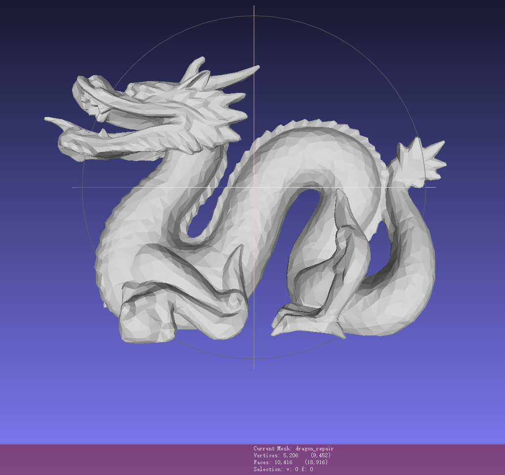
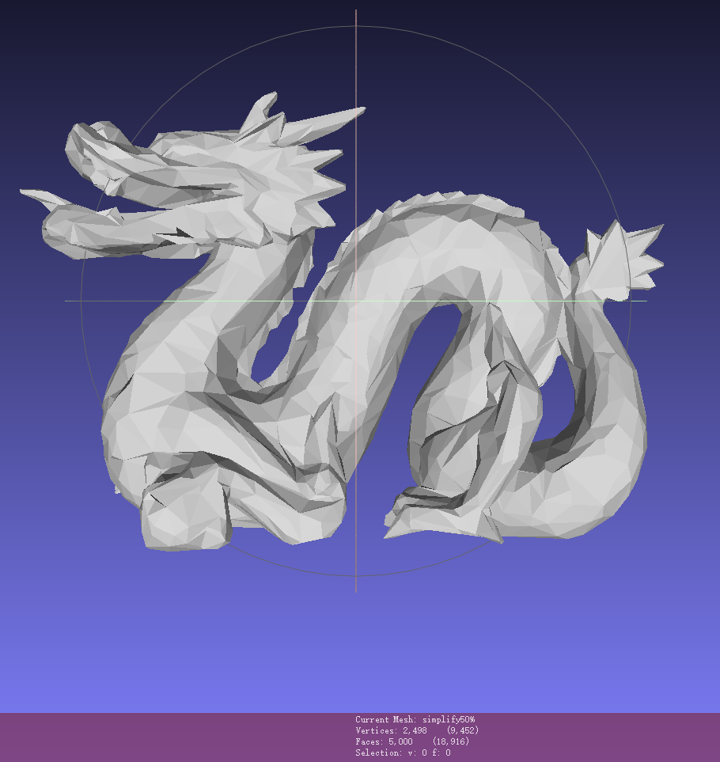
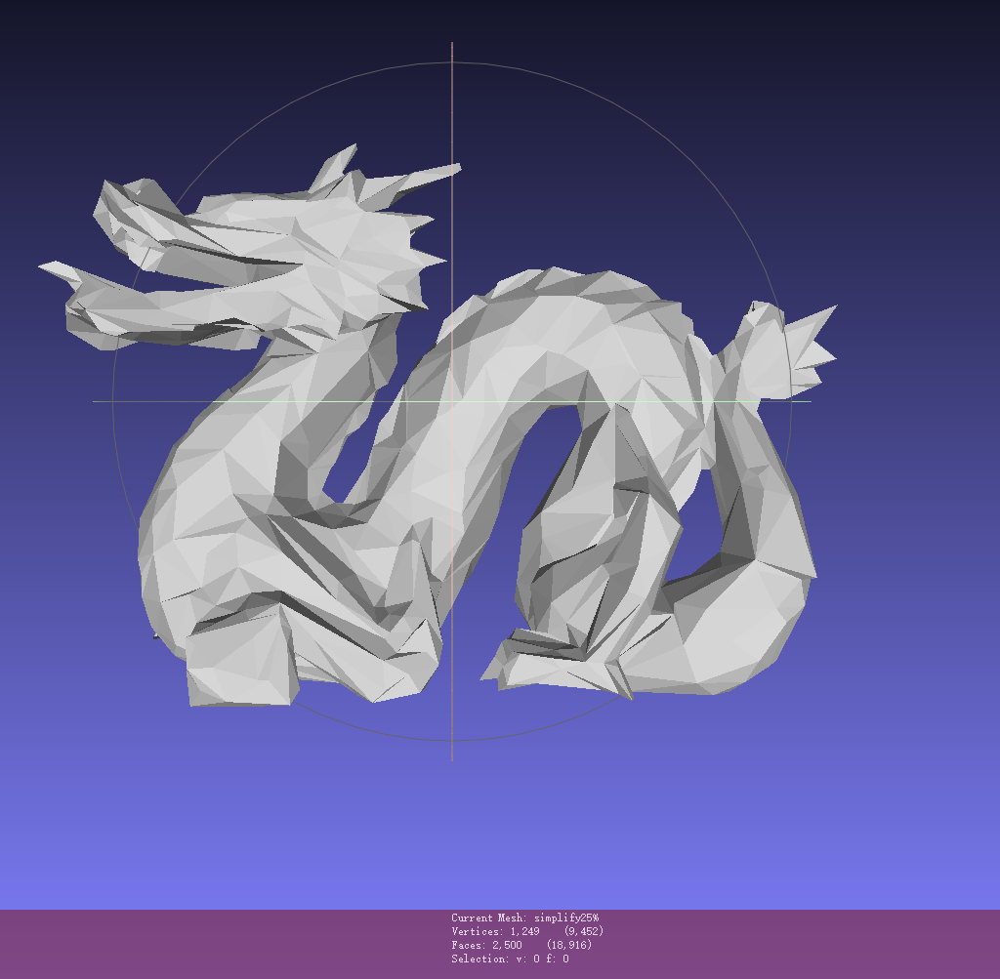
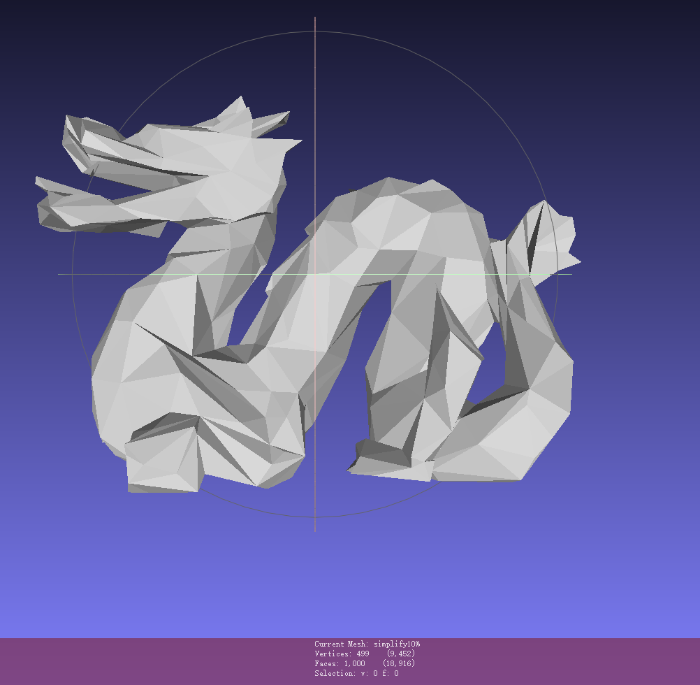
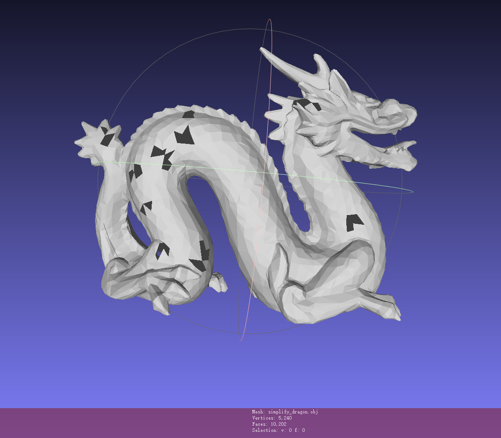
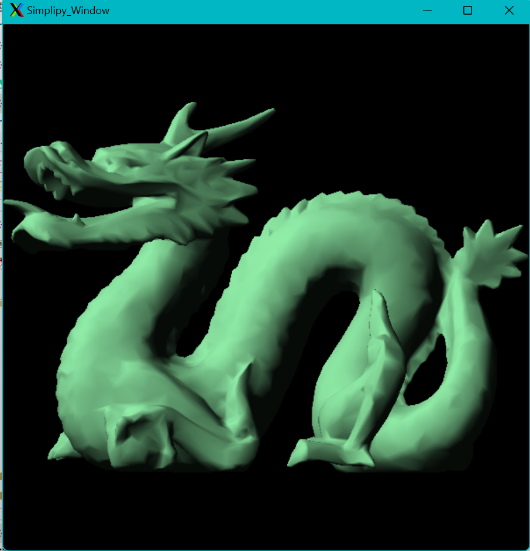
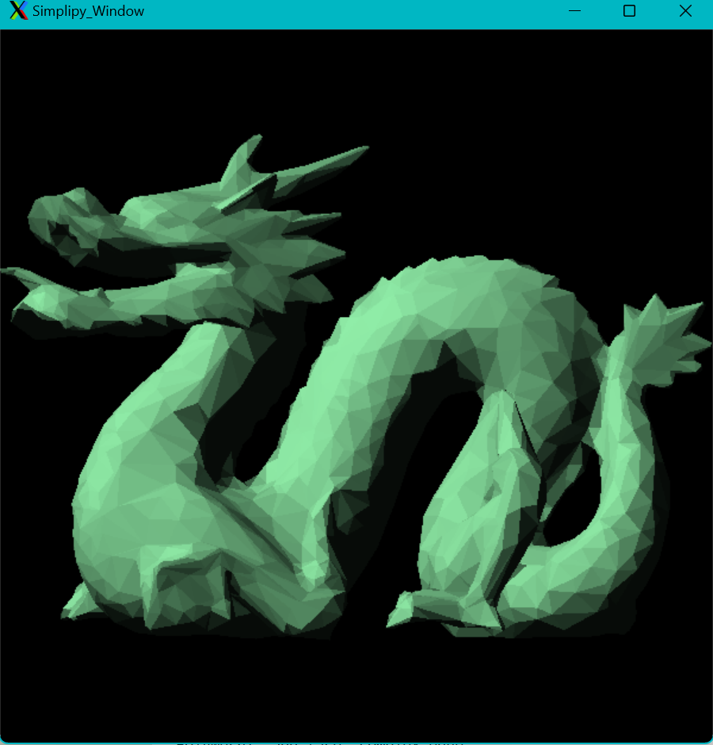
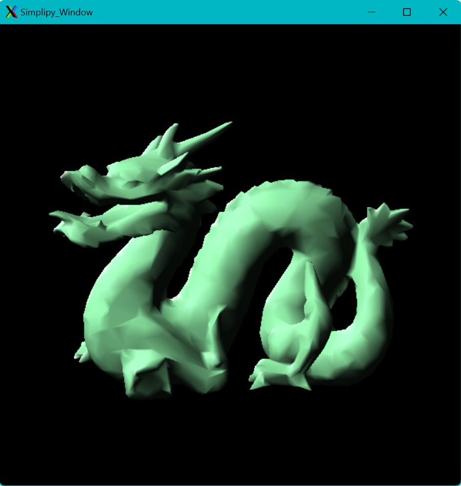
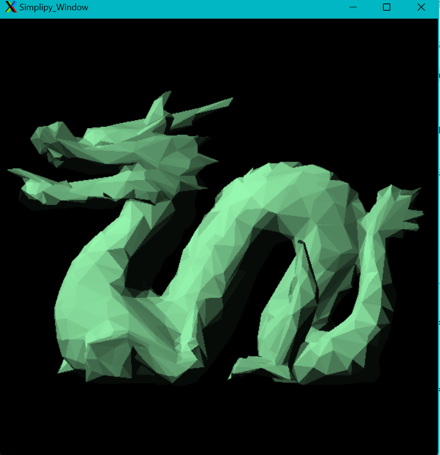
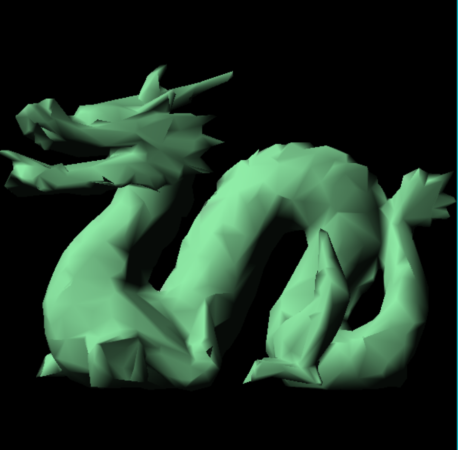

# 网格简化实验
## 使用说明
在终端输入**make all**编译网格简化实验代码,运行**make run**运行代码，其后可以跟上参数，以控制简化的模型、比例已经简化后的命名，例如
```
make run ARGS="dragon_repair simplified_dragon 0.6"
```
如果不输入参数名，则默认执行
```
dragon_repair simplified_dragon 0.5
```

重写了MAKEFILE，内容如下，共三个目标，**make all**, **make clean**, **make run**分别执行编译，删除和运行的任务。
```
TARGET = main

# 编译器
CC = g++

# 编译器参数
CFLAGS = -g -lglut -lGLU -lGL -lOpenMeshTools -lOpenMeshCore

# 源文件
SOURCES = main.cpp simplify.cpp

# 默认参数
DEFAULT_ARGS = dragon_repair simplified_dragon 0.5

# 默认目标
all: $(TARGET)

$(TARGET): $(SOURCES)
	$(CC) $(SOURCES) -o $(TARGET) $(CFLAGS)

run: $(TARGET)
	./$(TARGET) $(or $(ARGS),$(DEFAULT_ARGS))

clean:
	rm -f $(TARGET)
```
## 环境配置
本实验需要在原来的基础上增加两个库，一个是Eigen数学矩阵运算库，另一个是用来管理图形网格的openmesh库。
### Eigen
Eigen是一个高级的C++库，用于进行线性代数、矩阵和向量运算，数值计算以及相关的算法操作。

Eigen库的主要特点包括：
- 高效的矩阵和向量运算
- 支持各种不同的矩阵操作，如矩阵分解、求解线性方程组等
- 提供了大量的数学运算和算法，如数值积分、微分、解析函数等
- 代码简洁，易于使用和集成到其他项目中
- 高度优化，能够充分利用现代处理器的特性

### Openmesh
OpenMesh是一个通用和高效的开源库，用于处理和计算多边形网格。它是用C++编写的，提供了一套易于使用的类和函数来处理网格。

OpenMesh的主要特点包括：
- 灵活的网格数据结构：OpenMesh提供了一个通用的数据结构，可以用来表示各种类型的多边形网格。
- 高效的内存管理：OpenMesh使用了一种称为“自适应大小编码”的技术，可以有效地管理和存储网格数据。
- 易于使用的API：OpenMesh提供了一套简单易用的API，可以方便地进行网格的创建、修改和查询。
- 支持网格的IO操作：OpenMesh支持多种常见的网格文件格式，如.obj、.off、.ply等。
- 提供了一些基本的网格处理算法：如网格简化、网格细分、网格平滑等。

### 配置方法
- Eigen:
    - 从[Eigen的官方网站](http://eigen.tuxfamily.org/)下载最新的源代码包，或者从官方的Git仓库克隆源代码。

    - 解压源代码包，将Eigen的源代码目录复制或移动到你的项目目录，或者你的系统的包含文件目录（例如/usr/local/include），推荐后一种。
        
        - 例如，如果Eigen源代码目录在~/Downloads/eigen，可以使用以下命令将其复制到/usr/local/include：
            
                sudo cp -r ~/Downloads/eigen /usr/local/include/
                
    
    - 在C++代码中，使用#include <Eigen/Dense>等语句来包含Eigen的头文件。
                
                #include <Eigen/Dense>

- Openmesh:
    - 在官网下载openmesh的源码：

    https://www.graphics.rwth-aachen.de/software/openmesh/download/

    - 右键安装链接并复制，在终端输入：

    wget https://www.graphics.rwth-aachen.de/media/openmesh_static/Releases/9.0/OpenMesh-9.0.zip
    下载完毕后unzip解压，进入解压好的文件夹并make：
```
cd OpenMesh-9.0.0
mkdir build && cd build
cmake ..
```
出现Configuring done和Generating done后在当前目录的终端输入（可能会报错未安装Qt，无需管）：
```
make
```

等待编译完成后,输入如下以安装：
```
sudo make install
```

#### openmesh配置
使用官网给出的测试用例并使用如下命令编译：
```
g++ main.c -o main -lOpenMeshTools -lOpenMeshCore
```
如果报错：
```
error while loading shared libraries: libOpenMeshCore.so.9.0: cannot open shared object file: No such file or directory
```
可以使用whereis xxx查看该文件所处位置

下述命令每次登录都要输入，也可直接写入/etc/bash.bashrc，然后使用source /etc/bash.bashrc 让之立刻生效。

终端输入如下命令后可正常编译：
```
export LD_LIBRARY_PATH=/usr/local/lib/:$LD_LIBRARY_PATH
```
## 正常运行界面
如果上述配置没有问题，运行代码后将出现以下界面
```
./main dragon_repair simplified_dragon 0.5
the input file is dragon_repair
the output file is simplified_dragon
the ratio is 0.5
start simplify,it may take some minutes,please waiting patiently!
MakeHeap.....
Delete faces ... 5208
[======================================================================] 100 %
Delete faces done!
Time cost: 60s
Save model ... 
Model saved.
```
进度条可以标明简化进度，简化结束后，模型将被保存在output_model文件夹下。

## 代码部分说明
实验代码基本都在讲义PPT中给出，这里主要说一下类的定义和如何使用openmesh。
### 数据结构说明
首先是类定义，这里充分利用了C++的特性，定义各式容器来存储网格的顶点、面和法线等。
```
class mesh
{
    private:
        MyMesh om_mesh_;
        int sizeofvalidvertex;
        int sizeofvalidface;  
        vector<link> linkfaces;
        vector<link> linkpoints;
        vector<link> nearestpoints;
        vector<link> linkcostheaps;
        vector<bool>validvertices;
        vector<bool>validfaces;
        vector<bool>validcostheaps;
        vector<item> costheap;
        vector<Eigen::Matrix4d> Q;        
        void Initlize();
        Eigen::Matrix4d ComputeQ(int p);
        struct item Getcost(int pti,int ptj);
        void MakeHeap();
        void HeapPush(item temp);
        void DeleteVertex();
        Normal Normailize(int i);
        struct item HeapPop();
    public:
        mesh(const string & model_path)
        {
                if (!OpenMesh::IO::read_mesh(om_mesh_, model_path))
            {
                std::cerr << "Error loading model: " << model_path << std::endl;
                exit(1);
            }
             // 请求顶点法线属性
            om_mesh_.request_vertex_normals();
            om_mesh_.request_face_normals();

            // 更新顶点法线
            om_mesh_.update_normals();
            Initlize();
        };
        vector<Vertex> vertices;
        vector<Face> faces;
        vector<Texture> textures;
        vector<Normal> normals;
        vector<Normal> vertexnormals;
        
        void Simplify(double target);
        void Savemodel(const string & model_path);
};
```
该类的私人属性都是为网格简化服务的，所以外部不可以访问。初始化时会使用openmesh自带的导入obj文件的函数，也就是```read_mesh```，此后就可以通过访问该mesh来遍历
网格的拓扑结构。

为了使其服务于我自己的数据结构，我实现了一个```Initialize()```函数，该函数就是将拓扑结构导入到我自己的数据结构当中,不用我自己写函数实现：
```
   for (MyMesh::VertexIter v_it = om_mesh_.vertices_begin(); v_it != om_mesh_.vertices_end(); ++v_it)
    {   
        Vertex v;
        v.x = om_mesh_.point(*v_it)[0];
        v.y = om_mesh_.point(*v_it)[1];
        v.z = om_mesh_.point(*v_it)[2];
        vertices.push_back(v);
        validvertices.push_back(true);
        link l;
        for (MyMesh::VertexVertexIter vv_it = om_mesh_.vv_iter(*v_it); vv_it.is_valid(); ++vv_it)
        {
            l.push_back(vv_it->idx());
        }
        linkpoints.push_back(l);
    }
    sizeofvalidvertex = vertices.size();

    linkfaces.resize(vertices.size());
    for(auto it = om_mesh_.faces_begin(); it != om_mesh_.faces_end(); it++)
    {   
         Normal n;
         Face f;
         int i =0;
        for(auto fv_it = om_mesh_.fv_begin(*it); fv_it != om_mesh_.fv_end(*it); fv_it++)
        {
            Normal vn;
            f.vertex[i] = fv_it->idx();
            f.normal[i] = fv_it->idx();
            i++;
            vn.nx = om_mesh_.normal(*fv_it)[0];
            vn.ny = om_mesh_.normal(*fv_it)[1];
            vn.nz = om_mesh_.normal(*fv_it)[2];
            vertexnormals.push_back(vn);
        } 
        n.nx = om_mesh_.normal(*it)[0];
        n.ny = om_mesh_.normal(*it)[1];
        n.nz = om_mesh_.normal(*it)[2];
        normals.push_back(n);
        faces.push_back(f);
        validfaces.push_back(true);
    }
    sizeofvalidface = faces.size();
    for(auto it = om_mesh_.faces_begin(); it != om_mesh_.faces_end(); it++)
    {
        for(auto fv_it = om_mesh_.fv_begin(*it); fv_it != om_mesh_.fv_end(*it); fv_it++)
        {
            linkfaces[fv_it->idx()].push_back(it->idx());
        }
    }
    Q.resize(vertices.size());
    for(int i=0;i<vertices.size();i++)
    {
        Q[i] = ComputeQ(i);
    }

```
这一部分后，openmesh对代码就基本没什么作用了。本实验采用的是QEM算法，具体误差矩阵的计算方法和索引更新讲义都已给出，就不再赘述。
### 算法说明
简介一下QEM网格简化算法：
QEM（Quadric Error Metrics）网格简化算法是一种常用的网格简化算法，它通过最小化每个顶点的二次误差度量来简化网格。QEM算法只能用于三角网格的简化，对于更复杂的网格模型，可能需要其他的网格简化算法。

QEM算法流程如下：
- 初始化：计算每个顶点的二次误差度量（Quadric）。

- 边缩减：对于每一条边，计算如果将这条边缩减（即将这条边的两个顶点合并为一个顶点）后的误差，选择误差最小的边进行缩减。

- 更新误差度量：在每次边缩减后，需要更新与缩减后的顶点相邻的所有顶点的二次误差度量。

- 重复步骤2和3：重复边缩减和更新误差度量的步骤，直到达到预定的顶点数目或者误差度量达到预定的阈值。

- 结束：当达到预定的顶点数目或者误差度量达到预定的阈值时，算法结束，得到简化后的网格。

### 代码部分
需要说明的是两个比较麻烦的函数：
```HeapPop()和HeapPush()```

为了实现这两各函数，首先需要有一个存最小代价点对的容器，也就是**costheaps**，原本它应该是一个推排序的结果，但是如果是堆排序，插入点对后索引的更新将变得十分困难。
会增加更多的复杂度，所以我使用更简单的插入排序。
- HeapPop()
```
 bool repeat = false;
    //cost too much time!
    auto insertPos = std::upper_bound(costheap.begin(), costheap.end(), temp, CompareCost());
    
    for(auto &it:costheap){
        if(it==temp){
            repeat = true;
            break;
        }
    }
    if(!repeat){
        int idx = insertPos - costheap.begin();
        costheap.insert(insertPos, temp);
        validcostheaps.insert(validcostheaps.begin()+idx,true);
        linkcostheaps[temp.validpair.x()].push_back(idx);
        linkcostheaps[temp.validpair.y()].push_back(idx);
        for(auto &it:linkcostheaps){
            for(auto &it2:it){
                if(it2>idx)
                    it2++;
            }
        }
    }
```
可以看到，该函数每次插入一个点对都会判断是否重复，若不重复，通过C++的upper_bound找到第一个大于该点对的索引，从而实现插入排序，但是要注意到插入后，将要更新
所有插入位置之后的点对在linkcostheaps中的索引。这样实现起来比较简单，但是代价是，时间复杂度很高，大部分时间都是花在这个部分。
- HeapPush()
```
   int idx = 0;
    //cost too much time!
    while(!validcostheaps[idx]&&!(validvertices[costheap[idx].validpair.x()]&&validvertices[costheap[idx].validpair.y()]&&(costheap[idx].validpair.y()!=costheap[idx].validpair.x())))
    {
        if((idx < costheap.size() && costheap[idx].validpair.y()==costheap[idx].validpair.x())||!validvertices[costheap[idx].validpair.x()]&&!validvertices[costheap[idx].validpair.y()])
            validcostheaps[idx]=false;
        idx++;
    }
    item best = costheap[idx];
    validcostheaps[idx]=false;
    return best;
```
既然已经实现了插入排序，每次只需要从开头位置依次遍历找到第一个**valid**的索引，将该点对返回即可。这样就完成选择最小代价点对的作用。

## 网格简化效果
### 原图效果
顶点数：5206    面数：10416

### 50%简化效果
顶点数：2498    面数：5000

### 25%简化效果
顶点数：1249    面数：2500

### 10%简化效果
顶点数：499   面数：1000


可以看到上述效果都很好，即便是简化到0.1也可以基本保持和原本图形相似的形状，每个面都差不多大小，这表明网格简化效果很好。

另附一张初稿的效果：
非常惨烈

非常多破洞，最好检查出的原因是因为面的顶点索引更新条件错误，少连了一些边，但是误差矩阵显然是正确的，没出现奇怪的形状。

## 渲染效果
为了方便显示模型，利用的宏定义来控制是否需要简化，也就是当第一次运行模型简化结束后，直接从输出位置导入简化后模型进行渲染,默认是需要进行简化。
```
   #if NEED_SIMPLIY
        mesh Dragon(input_path);
        Dragon.Simplify(ratio);
        Dragon.Savemodel(output_path);
        mesh Simplify_Dragon(output_path);
        #else
        mesh Simplify_Dragon(input_path);
        #endif 
```
如果不需要简化，则默认输出简化后模型效果，**注意**前提是已经至少进行了一次模型简化，保证output_model文件夹下存在模型。

### 原图效果

### 50%简化效果

顶点法线平行效果：


顶点法线原始效果:

### 30%简化效果

顶点法线平行效果：


顶点法线原始效果:
