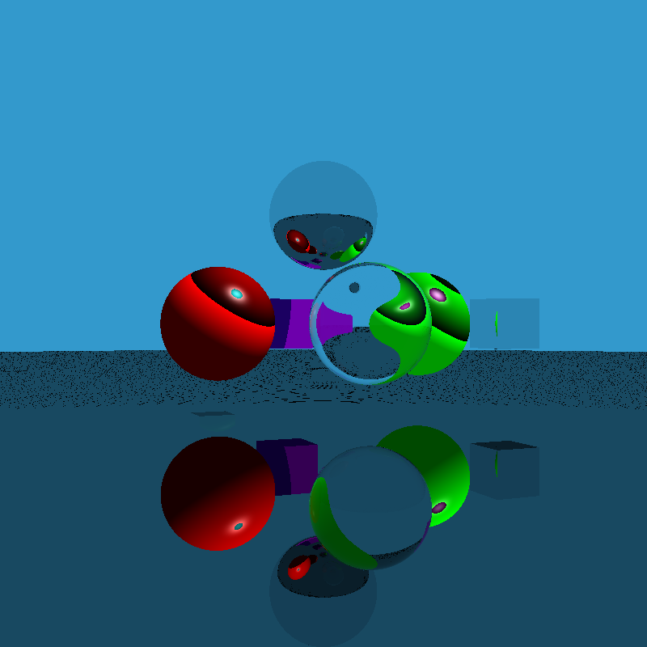

# 光线追踪实验
## 使用说明

MAKEFILE共四个目标，**make all**, **make clean**, **make run**，**make run-gif**分别执行编译，删除和运行任务。

注意：在终端输入**make all**编译光线追踪实验代码, 运行**make run**运行代码，此时不会生成gif图片，执行**make run-gif**则会生成10帧的图像并转化为gif图片。

内容如下：
```
# 编译器
CC = g++

# 编译器参数
CFLAGS = -g -lglut -lGLU -lGL -pthread 

# 源文件
SOURCES = src/main.cpp src/ray_tracing.cpp

# 目标文件
TARGET = main

# 默认参数
DEFAULT_ARG = NO

# 默认目标
all: $(TARGET)

$(TARGET): $(SOURCES)
	$(CC) $(SOURCES) $(CFLAGS) -o $(TARGET)

run: $(TARGET)
	./$(TARGET) $(DEFAULT_ARG)

run-gif: $(TARGET)
	./$(TARGET) YES
	python3 src/creategif.py

clean:
	rm -f $(TARGET)
```
## 环境配置
本实验需要在OPENGL库的基础上增加一个库，即GLM（OpenGL Mathematics）数学库，GLM提供了类和函数来处理2D和3D向量、矩阵、四元数、欧拉角等，这些都是图形编程中常用的数学概念。
### GLM库的主要特点：

- 与GLSL语法和函数相似，使得在C++中进行图形编程更加直观和方便。
- 提供了大量的数学运算和函数，包括向量和矩阵运算、几何变换、随机数生成等。
- 无需依赖OpenGL或其他图形API，可以在任何C++项目中使用。
- 高度优化，能够充分利用现代处理器的特性

### 配置方法

- 从[GLM的开源网站](https://github.com/g-truc/glm/releases/tag/0.9.8.0)下载最新的源代码包

- 解压源代码包，将源代码目录复制或移动你的系统的包含文件目录（例如/usr/local/include）
    
    - 例如，如果GLM源代码目录在~/Downloads/GLM，可以使用以下命令将其复制到/usr/local/include：
        
            sudo cp -r ~/Downloads/GLM /usr/local/include/
            

- 在C++代码中，使用#include <Eigen/Dense>等语句来包含Eigen的头文件。
            
            #include <glm/gtc/matrix_transform.hpp>
            #include <glm/gtc/type_ptr.hpp>
            #include <glm/glm.hpp>


## 正常运行界面
如果上述配置没有问题，运行代码后将会出现窗口，跟Exam2的控制方法一致，方向键实现旋转，鼠标左右键实现缩放。

因为每次渲染都需要较长时间，因此每次DrawScene调用都会将图像保存在**outpic/**目录下，如何保存图片后文会解释。

## 代码部分说明
本次实验主要参考[OpenGL递归实现光线追踪](https://blog.csdn.net/weixin_59008623/article/details/126163209)

具体说明可以去源地址查看，我主要在其基础上更改了类定义以支持更多形状和纹理，主要逻辑遵循源代码设计，另外也增加了保存图片和显示的函数，而不必安装GLEW库，

### 数据结构说明

这里挑几个重要的类定义进行说明，我重新改写了这几个类
```
class Shape {
public:
    Material *material;
    ImageTexture *tex;

    Shape(Material *material) : material(material), tex(nullptr) {}

    virtual ~Shape() {}

    virtual float Intersect(const Ray &ray, glm::vec3 *hitNorm, glm::vec3 *hitPos) = 0;
};

// 球体
class Sphere : public Shape {
    glm::vec3 center;
    float radius;

public:
    Sphere(glm::vec3 center, float radius, Material *material)
        : center(center), radius(radius), Shape(material) {}
    float Intersect(const Ray &ray, glm::vec3 *hitNorm, glm::vec3 *hitPos) override;
};

class Cube : public Shape {
    glm::vec3 center;
    float edgeLength;

public:
    Cube(glm::vec3 center, float edgeLength, Material *material)
        : center(center), edgeLength(edgeLength), Shape(material) {}
    float Intersect(const Ray &ray, glm::vec3 *hitNorm, glm::vec3 *hitPos) override;
};
```

这三个类定义中，Shape类为虚类，不会被实例化，Sphere类和Cube类基于Shape类派生，因此可以针对不同的形状来实现不同的相交函数。

利用```float Intersect(const Ray &ray, glm::vec3 *hitNorm, glm::vec3 *hitPos) override;```改写即可，然后使用```objects[i]->Intersect(ray, &_hit_norm, &_hit_pos);```求交。

其他类的定义都很常规，符合规范，可以到参考连接中查看。

### 图片保存说明
#### 图片保存

将光追渲染出来的结果进行保存，需要引入C语言的标准图像处理库**stb_image_write.h**，然后调用其中的函数```stbi_write_png```进行保存，注意到OPENGL的屏幕保存的像素默认从左下角开始，因此图像是上下颠倒的，因此写了一个函数**flipImage**来进行翻转。

```
void flipImage(GLubyte* pixels, int width, int height, int channels) {
    int stride = width * channels;
    GLubyte* row = new GLubyte[stride];
    for (int y = 0; y < height / 2; y++) {
        memcpy(row, pixels + y * stride, stride);
        memcpy(pixels + y * stride, pixels + (height - 1 - y) * stride, stride);
        memcpy(pixels + (height - 1 - y) * stride, row, stride);
    }
    delete[] row;
}
```
#### GIF生成
原要求是生成视频，但是更简单的做法是直接将渲染生成的图像帧拼接为gif格式的图片，这使用了python来实现，如果是使用C++则需要调用OPENCV库，会更麻烦一点

代码部分如下：
```
import imageio

def create_gif_from_images(image_paths, output_gif_path):
    images = []
    for image_path in image_paths:
        images.append(imageio.imread(image_path))
    imageio.mimsave(output_gif_path, images, 'GIF', duration = 0.5)

# 使用示例
image_paths = [f"./outpic/output_{i}.png" for i in range(11)]
output_gif_path = "output.gif"
create_gif_from_images(image_paths, output_gif_path)
```
使用命令安装库
    
    pip install imageio

### 文件说明
项目文件夹结构如下：

- `/src`：源代码文件夹
  - `main.cpp`：主程序文件
  - `ray_tracing.cpp`：光线追踪算法实现
  - `creategif.py`:gif图像生成
- `/include`：头文件文件夹
  - `header.h`：类定义头文件
  - `material.h`:材质定义头文件
  - `stb_image_write.h`:图像保存标准头文件
- `/outpic`：保存头文件说明
- `Makefile`：用于编译项目的Makefile
- `README.md`：项目说明文件
- `output.gif`:示例的gif图像文件

## 渲染效果
默认不会生成gif文件，如果需要的花，则运行make run-gif命令

效果如下：


### 注意
可以看到视野远处出现了摩尔纹现象，这是由于没有做反走样，存在一定量的噪点，但是整体效果还不错。虽然我增加了纹理的定义，但实际上并未使用纹理，但添加纹理也很简单，由于时间有限我就没有实现。

同时也未添加阴影，所以部分秋阴影处有些混乱，但总体效果还行。